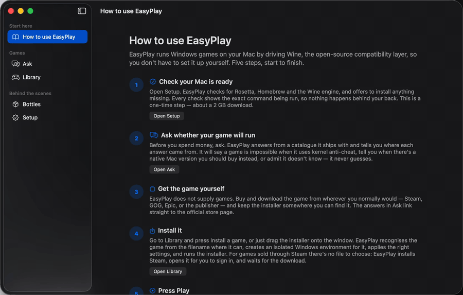
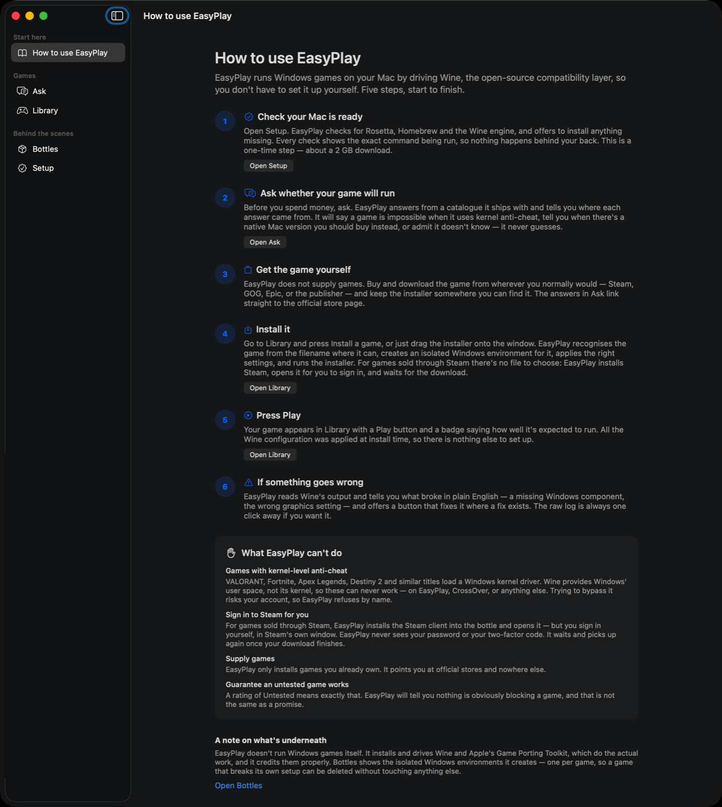
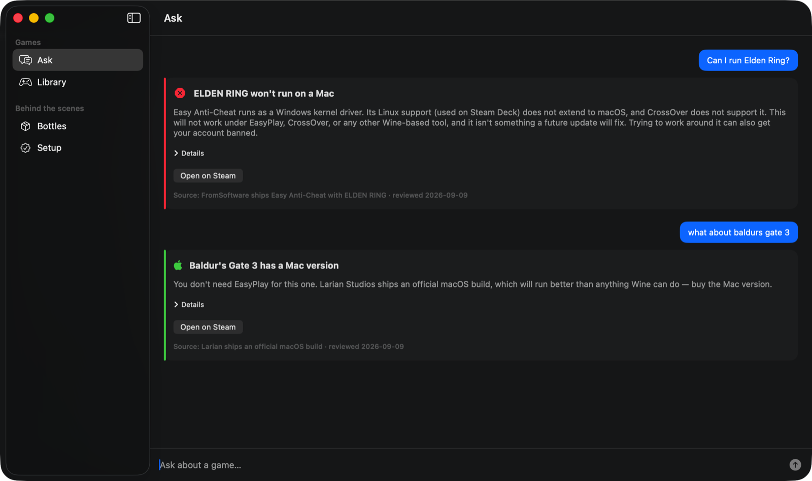
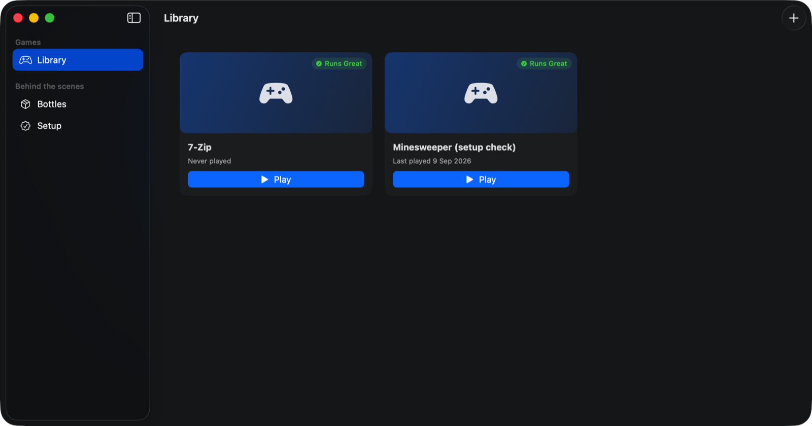
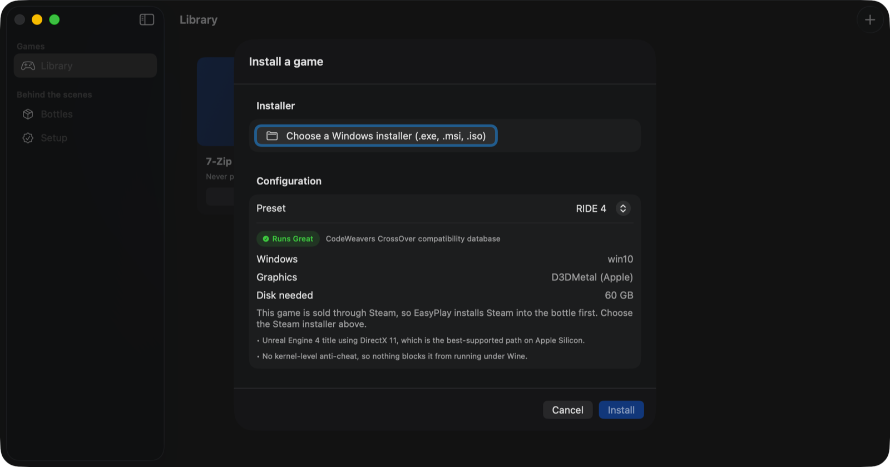
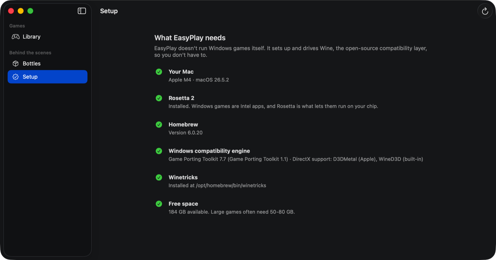

# EasyPlay

A Mac launcher for Windows games, built on top of Wine.

EasyPlay does not translate Windows APIs, emulate x86, or implement any part of
DirectX. Those problems are solved — by [Wine](https://www.winehq.org), by
[DXVK](https://github.com/doitsujin/dxvk), by Apple's Rosetta 2 and D3DMetal.
What isn't solved is *using* them: a working setup means hand-built prefixes,
DLL override tables, environment variables nobody documents, and error messages
written for Wine developers.

EasyPlay is a thin, well-behaved layer over tools that already work. It creates
the prefix, applies a known-good configuration for the game you're installing,
runs the installer, and gives you a Play button. When something breaks, it tells
you what broke in a sentence instead of handing you 400 lines of `err:module:`.

---

## What it looks like

<p align="center">
  
</p>

Forty seconds, recorded from the running app: ask whether ELDEN RING runs (it
can't — kernel anti-cheat) and whether Baldur's Gate 3 does (buy the Mac
version), then the library, the install sheet applying the RIDE 4 preset, the
bottle behind it, and the environment check. Re-recordable with
[`Scripts/record-demo.sh`](Scripts/record-demo.sh), which drives the real app
rather than staging anything.

<p align="center">
  
</p>

The instructions live in the app, not just in this README — this screen opens on
first run. Six steps from setup to pressing Play, each with a button that takes
you there, and a panel stating plainly what EasyPlay **can't** do: kernel
anti-cheat, signing in to Steam for you, supplying games, or promising that an
untested game works. A user who hits an undocumented limit assumes the app is
broken.

<p align="center">
  
</p>

Ask, before you buy. EasyPlay answers from a catalogue it ships with and shows
where every answer came from. It will tell you a game is impossible (kernel
anti-cheat), that you don't need EasyPlay at all (there's a native Mac build), or
that it simply doesn't know — it never guesses, because a confident wrong "yes"
costs you a purchase and a 50 GB download.

<p align="center">
  
</p>

The library. Two installed programs, each with a compatibility badge and one
button. Everything Wine needs — the prefix, the DLL overrides, the environment —
was applied when they were installed.

<p align="center">
  
</p>

The guided install, with the RIDE 4 preset selected. The preset is chosen
automatically when the installer's filename is recognised, and it is shown rather
than hidden: the rating, where that rating came from, the Windows version, the
graphics translator and the disk it needs are all on screen before anything is
written to your Mac.

<p align="center">
  
</p>

Setup. Every dependency is checked, and anything missing comes with a plain
explanation and the exact command — which you can copy and run yourself instead
of pressing the button.

---

## What it does

| | |
|---|---|
| **Explains itself** | A step-by-step guide lives inside the app, opens on first run, and states plainly what EasyPlay cannot do. |
| **Answers "will it run?"** | Ask about a game in plain language before buying it. Answers come from a bundled catalogue with sources and review dates — never from a guess. |
| **Checks your Mac** | Apple Silicon, Rosetta 2, Homebrew, a Wine build, disk space — with a copyable command for anything missing. |
| **Manages bottles** | One isolated Windows environment per game. A game that corrupts its own configuration can be deleted without touching the others. |
| **Applies presets** | Per-game JSON "recipes" carrying Windows version, DLL overrides, graphics translator, environment variables and Winetricks verbs. |
| **Guides installs** | Drag in a Windows installer; EasyPlay recognises it, builds a matching bottle, and runs it. |
| **Launches games** | One button. All the Wine configuration was applied earlier. |
| **Explains failures** | Wine's output is pattern-matched against known problems and rendered as plain English with a fix button where one exists. |
| **Rates compatibility** | Runs Great / Runs OK / Untested / Not Supported, per preset, with the source of the rating. |
| **Proves the graphics path** | `easyplay probe` inspects a running game and reports which translator it is *really* using — Wine falls back silently, and a game on the wrong renderer runs badly rather than failing. |

## What it deliberately does not do

- **No new translation layer.** EasyPlay shells out to an installed Wine. There
  is no emulation, hypervisor, or Win32 reimplementation anywhere in this repo,
  and there never will be.
- **No kernel anti-cheat.** Games using Vanguard, EasyAntiCheat or BattlEye
  cannot work under Wine — the anti-cheat needs a Windows kernel driver, and
  Wine implements Windows' user space, not its kernel. EasyPlay refuses these by
  name and explains why rather than failing mysteriously. Attempting to bypass
  anti-cheat also risks your account.
- **No accounts, no cloud, no preset server.** Presets are JSON files on disk.
  You can read them, edit them, and share one by sending a file.

---

## Requirements

- Apple Silicon Mac (M1 or later), macOS 14+
- Rosetta 2 — Windows game binaries are x86-64
- [Homebrew](https://brew.sh)
- A Wine build. EasyPlay targets Apple's Game Porting Toolkit, packaged by
  Gcenx:

  ```bash
  brew tap Gcenx/wine
  brew install --cask gcenx/wine/game-porting-toolkit
  brew install winetricks
  ```

  > The official `wine-stable`, `wine@devel` and `wine@staging` casks were
  > disabled in homebrew-cask on 2026-09-01 for failing macOS Gatekeeper checks,
  > so they are not currently an installable path. EasyPlay detects them if you
  > have them, but recommends Game Porting Toolkit, which is also the only one of
  > the three with Metal-backed DirectX.

EasyPlay's setup screen checks all of this and offers to run the install for you.

## Building

No Xcode required — the project builds with the Command Line Tools alone.

```bash
git clone <this repo> && cd EasyPlay
./Scripts/build-app.sh release
open build/EasyPlay.app
```

Run the tests:

```bash
swift run easyplay-tests
```

## The command line

Every operation the app performs is also a CLI command. The GUI is the product,
but the CLI keeps the engine honest — logic that only works when a SwiftUI view
drives it is logic in the wrong place.

```bash
swift run easyplay ask "can I run Elden Ring?"   # will it work before you buy?
swift run easyplay doctor                 # check this Mac
swift run easyplay recipes                # list presets
swift run easyplay recipes ride-4         # inspect one
swift run easyplay bottle-create "RIDE 4" --recipe ride-4
swift run easyplay verify <bottle-id>     # prove the bottle runs Windows programs
swift run easyplay install setup.exe --bottle <id>
swift run easyplay steam-install ride-4     # sets up Steam, waits for the download
swift run easyplay games
swift run easyplay play <game-id>
```

## Current status

Verified on an M4 Mac running macOS 26.5.2 with Game Porting Toolkit 3.0
(Wine 7.7):

- Environment detection, including deduplicating the Homebrew symlinks that make
  one Wine installation look like two
- Bottle creation, Windows-version and DLL-override registry configuration
- **The full install flow, end to end**: a real Windows installer
  (7-Zip 23.01 x64) auto-matched to its preset by filename, a bottle created and
  configured, the installer run silently under Wine, the resulting `7zFM.exe`
  located by glob, and the program launched and confirmed running as a live
  `wine64` process before being shut down cleanly
- **The DirectX 11 path, proven end to end**: a 64-bit DX11 benchmark launched
  through EasyPlay maps `D3DMetal.framework`, `libmetalirconverter` (DXIL to
  Metal IR shader conversion) and the `AGXMetalG16G` Apple GPU driver — DirectX
  11 reaching an M4 GPU through Metal. `easyplay probe <game-id>` reports this
  for any game, so "configured for D3DMetal" and "actually using D3DMetal" can
  be told apart
- The compatibility advisor, over a 101-game catalogue: 44 titles with a native
  macOS build, 27 blocked by kernel anti-cheat, the rest with no known blocker.
  Native-Mac status is verified against Steam's platform data rather than
  asserted
- 281 unit checks across the environment builder, glob matcher, log classifier
  and preset loader — including a regression case built from the real install
  log, asserting that Wine's harmless shortcut-builder errors raise no false
  alarm

Steam installs work: EasyPlay downloads Valve's installer, sets Steam up inside
the game's bottle, opens it at the game's install page, then follows the download
by reading Steam's own `appmanifest_*.acf` until it reports fully installed.
Verified on this Mac up to the sign-in handoff — the client installs, launches and
pulls its own update inside the bottle. **EasyPlay never handles Steam
credentials**: you sign in in Steam's window, so the last leg of that flow is by
design something only you can complete.

Known gaps, stated rather than buried:

- **DXVK is selectable but not provisioned.** The recipe field and DLL overrides
  work; downloading a DXVK build into a bottle does not. In practice this costs
  nothing on Apple Silicon, because this Game Porting Toolkit build ships no
  Vulkan at all, so D3DMetal is the right choice anyway.
- Two diagnostic remedies (`steam:start`, `bottle:recreate`) are recognised and
  explained but not automated.
- Wizard-style installers work, but EasyPlay only watches for the game they
  leave behind — it can't drive the wizard for you, and a repack or installer
  that needs Windows components the bottle lacks will still fail.

Not yet verified end to end: the RIDE 4 preset itself. Its rating is inherited
from CrossOver's published compatibility database, not from a local run — the
game isn't owned yet. `COMPATIBILITY.md` says exactly which settings are
reasoned and which are measured, and the preset is labelled accordingly in the
UI. The Steam-based install path it needs is also still unwritten.

---

## Licence

MIT — see [LICENSE](LICENSE).

EasyPlay drives Wine, Game Porting Toolkit, DXVK and Winetricks as external
processes installed separately through Homebrew. It does not copy, link against
or redistribute any of them, so their licences apply to those installations
rather than to this repository — see [NOTICE.md](NOTICE.md) for the details.

## Credits

EasyPlay is a wrapper. The hard parts belong to other people:

- **[Wine](https://www.winehq.org)** — the compatibility layer that runs the
  games. LGPL-2.1.
- **[Apple Game Porting Toolkit / D3DMetal](https://developer.apple.com/games/)**
  — DirectX 11 and 12 translated to Metal, packaged for Homebrew by
  **[Gcenx](https://github.com/Gcenx)**.
- **[DXVK](https://github.com/doitsujin/dxvk)** and
  **[MoltenVK](https://github.com/KhronosGroup/MoltenVK)** — the Vulkan route,
  supported as a per-preset option.
- **[Winetricks](https://github.com/Winetricks/winetricks)** — Windows runtime
  installation.
- **[CodeWeavers](https://www.codeweavers.com/compatibility)** — the public
  compatibility database the first presets draw their ratings from.
- **[Whisky](https://github.com/Whisky-App/Whisky)** — the SwiftUI Wine wrapper
  that proved this idea and was archived in 2025. EasyPlay is not derived from
  its code; the preset layer is what it never had.
